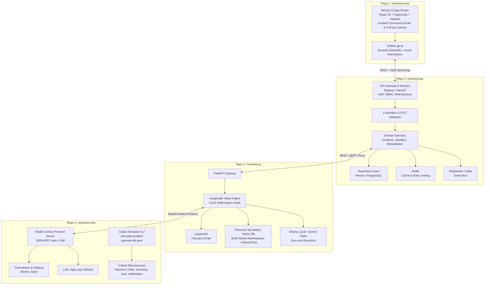
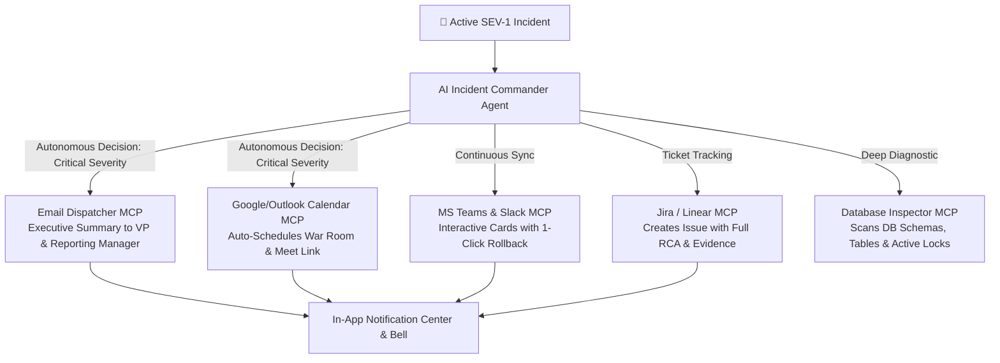

# ResolveIQ — AI Incident & Operations Resolution Platform

> **An Autonomous SRE & Production Incident Resolution Engine** powered by Full Stack Architecture, LangGraph Multi-Agent Workflows, Model Context Protocol (MCP), Pinecone Serverless Hybrid RAG, and Human-in-the-Loop Remediation.

---

## 1. Executive Summary & Problem Statement

### The Problem
When a SEV-1 production incident strikes, engineering teams spend **hours to days** manually sifting through fragmented systems: querying Datadog/Prometheus dashboards, scrolling thousands of lines in CloudWatch/Loki logs, checking recent Git/ArgoCD deployments, reading outdated runbooks, and searching historical Slack post-mortems. 

* **The Business Impact**: Production downtime costs Fortune 500 enterprises an average of **$9,000 per minute**.
* **The Root Cause**: High MTTR (Mean Time to Resolution) is caused by human cognitive overload during triage.

### The Solution
**ResolveIQ** ingests telemetry across the entire stack, triggers an autonomous **LangGraph** multi-agent swarm using **MCP tools**, queries internal engineering runbooks via **Pinecone Serverless RAG**, calculates root cause probability with verified evidence, and presents an executable remediation plan for **Human-in-the-Loop (HITL) approval**.

---

## 2. High-Level Architecture



---

## 3. Low-Level Architecture

### 3.1 LangGraph Multi-Agent State Machine
The AI investigation is modeled as a stateful, cyclical graph with persistent checkpoints and human intervention gates:

```mermaid
graph TD
    START([Incident Ingested]) --> CLASSIFIER[Incident Classifier Node<br>App vs Infrastructure vs Network]
    
    CLASSIFIER --> EVIDENCE[Evidence Collector Node<br>Calls MCP Tools: query_metrics, query_logs]
    
    EVIDENCE --> LOG_ANALYZER[Log & Error Analyzer Node<br>Extracts Error Signatures & Stack Traces]
    
    LOG_ANALYZER --> RAG[Pinecone RAG Retriever Node<br>Hybrid Search on Runbooks & Past Post-Mortems]
    
    RAG --> RCA[RCA Synthesizer Node<br>Calculates Root Cause & Confidence Score]
    
    RCA --> CONFIDENCE{Confidence > 80%?}
    
    CONFIDENCE -->|Yes| REMEDIATION[Remediation Planner Node<br>Drafts Rollback or Scaling Action]
    CONFIDENCE -->|No| ASK_HUMAN[Clarification Node<br>Requests Operator Input in UI]
    
    REMEDIATION --> CHECKPOINT{{Human-in-the-Loop Checkpoint<br>LangGraph interrupt()}}
    
    CHECKPOINT -->|Operator Approves| EXECUTE[Execute Remediation via MCP<br>e.g. Rollback Kubernetes Deployment]
    CHECKPOINT -->|Operator Rejects| REPLAN[Re-evaluate Action]
    
    EXECUTE --> VERIFY[Verification Node<br>Monitors Telemetry for Metric Recovery]
    
    VERIFY --> CLOSED([Incident Resolved & Closed])
```

### 3.2 Pinecone Serverless RAG Architecture
To prevent hallucinations and retrieve company-specific runbooks:
* **Index**: Single serverless index with low-latency search (`resolveiq-knowledge`).
* **Multi-Tenancy**: Isolated namespaces per organization (`org_acme_corp`, `org_initech`).
* **Metadata Filtering**:
  ```json
  {
    "service": "payment-api",
    "environment": "production",
    "document_type": "runbook",
    "severity": "SEV-1"
  }
  ```
* **Hybrid Retrieval**: Combines sparse BM25 keyword tokens (matching exact error strings like `PG::ConnectionBad` or `ECONNRESET`) with dense semantic vector representations.

### 3.3 Model Context Protocol (MCP) Tool Contract
The agent does not use hardcoded API calls. Tools are discovered and called dynamically via the **Model Context Protocol (JSON-RPC)**:

| MCP Tool Name | Parameters | Purpose |
|---|---|---|
| `get_service_health` | `service: string` | Returns latency, error rate, and container pod health. |
| `query_metrics` | `service: string, metric: string, time_range: string` | Queries Prometheus for CPU, memory, and DB connection metrics. |
| `query_logs` | `service: string, level: string, query: string` | Fetches filtered application logs matching error signatures. |
| `get_recent_deployments`| `service: string` | Inspects recent CI/CD deployments and Git commits. |
| `search_runbooks` | `query: string, service: string` | Queries Pinecone for relevant operational documentation. |
| `search_previous_incidents` | `signature: string` | Matches current incident against historical resolved post-mortems. |
| `execute_rollback` | `service: string, target_version: string` | Reverts deployment image after human approval. |

---

## 4. Complete Project Directory Structure

```
resolveiq/
│
├── apps/
│   │
│   ├── resolveiq-web/                          # [Repo 1] Next.js 15 Frontend
│   │   ├── src/
│   │   │   ├── app/                            # Next.js 15 App Router (Server Components)
│   │   │   │   ├── layout.tsx                  # Root layout, theme, metadata
│   │   │   │   ├── page.tsx                    # Landing / redirect to dashboard
│   │   │   │   ├── dashboard/
│   │   │   │   │   └── page.tsx                # High-level system overview (Server Component)
│   │   │   │   ├── incidents/
│   │   │   │   │   ├── page.tsx                # Paginated incident feed (Server Component)
│   │   │   │   │   └── [id]/
│   │   │   │   │       ├── page.tsx            # Incident Command Center (Server Component)
│   │   │   │   │       └── loading.tsx         # Skeleton loader
│   │   │   │   ├── services/
│   │   │   │   │   ├── page.tsx                # Service catalog
│   │   │   │   │   └── [id]/page.tsx           # Service topology & telemetry
│   │   │   │   ├── knowledge/
│   │   │   │   │   └── page.tsx                # Runbooks & vector search explorer
│   │   │   │   └── audit/
│   │   │   │       └── page.tsx                # Audit trail & compliance log
│   │   │   │
│   │   │   ├── components/                     # Modular Component Tree
│   │   │   │   ├── ui/                         # Base primitives (Button, Badge, Modal, Tabs)
│   │   │   │   ├── layout/                     # Header, Sidebar, CommandBar
│   │   │   │   ├── incidents/                  # Incident-specific components
│   │   │   │   │   ├── IncidentHeader.tsx      # Severity badge, timer, status
│   │   │   │   │   ├── TelemetryGrid.tsx       # Split view (Metrics vs Logs)
│   │   │   │   │   ├── MetricsChart.tsx        # ['use client'] Live telemetry chart
│   │   │   │   │   ├── LogViewer.tsx           # ['use client'] Streaming terminal log viewer
│   │   │   │   │   ├── RemediationBox.tsx      # ['use client'] Action card & approve button
│   │   │   │   │   └── ApprovalModal.tsx       # ['use client'] Human sign-off modal
│   │   │   │   └── agent/                      # AI Investigation components
│   │   │   │       ├── AgentFlowCanvas.tsx     # ['use client'] Live XYFlow node graph
│   │   │   │       ├── ReasoningStream.tsx     # ['use client'] Real-time SSE thought stream
│   │   │   │       └── AskAIChat.tsx           # ['use client'] Interactive "Ask AI Why" drawer
│   │   │   │
│   │   │   ├── services/                       # Centralized API Layer
│   │   │   │   └── api.ts                      # UNIFIED dynamic Axios client with all endpoints
│   │   │   │
│   │   │   ├── hooks/                          # React Query & WebSocket hooks
│   │   │   │   ├── useIncident.ts
│   │   │   │   └── useAgentStream.ts
│   │   │   │
│   │   │   ├── types/
│   │   │   │   └── index.ts                    # Strict TypeScript domain interfaces
│   │   │   │
│   │   │   └── lib/
│   │   │       ├── utils.ts                    # Tailwind clsx merger, date formatters
│   │   │       └── constants.ts                # Severity badges & color tokens
│   │   ├── package.json
│   │   └── tsconfig.json
│   │
│   ├── resolveiq-api/                          # [Repo 2] Enterprise Gateway Backend
│   │   ├── src/
│   │   │   ├── modules/                        # Domain-driven modules (Router -> Controller -> Service -> Repository)
│   │   │   │   ├── incidents/
│   │   │   │   │   ├── incidents.router.ts     # Routes & middleware mapping
│   │   │   │   │   ├── incidents.controller.ts # Request/response validation & handling
│   │   │   │   │   ├── incidents.service.ts    # Business logic & event dispatching
│   │   │   │   │   └── incidents.repository.ts # Data access layer (Prisma/DB)
│   │   │   │   │
│   │   │   │   ├── services/                   # Service catalog & health tracking
│   │   │   │   │   ├── services.router.ts
│   │   │   │   │   ├── services.controller.ts
│   │   │   │   │   └── services.service.ts
│   │   │   │   │
│   │   │   │   ├── sandbox/                    # Chaos simulation engine
│   │   │   │   │   ├── sandbox.router.ts
│   │   │   │   │   ├── sandbox.controller.ts
│   │   │   │   │   └── sandbox.service.ts
│   │   │   │   │
│   │   │   │   ├── telemetry/                  # Metrics & log ingest webhook endpoints
│   │   │   │   └── audit/                      # Compliance event logger
│   │   │   │
│   │   │   ├── common/                         # Shared middleware & filters
│   │   │   │   ├── middleware/                 # RateLimiter, RequestLogger, TenantContext
│   │   │   │   └── guards/                     # RBAC & Auth guards
│   │   │   │
│   │   │   ├── infrastructure/                 # External service clients
│   │   │   │   ├── database/                   # Prisma client
│   │   │   │   ├── event-bus/                  # Kafka / Redpanda producer & consumers
│   │   │   │   └── cache/                      # Redis client
│   │   │   │
│   │   │   └── server.ts                       # Express/NestJS entry point
│   │   ├── package.json
│   │   └── tsconfig.json
│   │
│   └── resolveiq-ai/                           # [Repo 3] AI Agent Orchestration Service
│       ├── src/
│       │   ├── api/                            # FastAPI HTTP & SSE Endpoints
│       │   │   ├── router.py                   # Main API router
│       │   │   └── endpoints/
│       │   │       ├── investigate.py          # POST /investigate, GET /stream
│       │   │       ├── rca.py                  # POST /rca
│       │   │       ├── knowledge.py            # POST /knowledge/query
│       │   │       └── chat.py                 # POST /chat ("Ask AI Why")
│       │   │
│       │   ├── agents/                         # LangGraph Multi-Agent Engine
│       │   │   ├── state.py                    # InvestigationState TypedDict
│       │   │   ├── graph.py                    # StateGraph builder with nodes & edges
│       │   │   ├── nodes/                      # Discrete agent node functions
│       │   │   │   ├── classifier_node.py      # Identifies incident category
│       │   │   │   ├── evidence_collector_node.py # Queries metrics & logs via MCP
│       │   │   │   ├── log_analyzer_node.py    # Extracts error stack traces
│       │   │   │   ├── runbook_retriever_node.py # Pinecone RAG hybrid search
│       │   │   │   ├── rca_synthesizer_node.py # Computes root cause & confidence
│       │   │   │   └── remediation_planner_node.py # Builds rollback/scaling plan
│       │   │   └── checkpoints/                # LangGraph state memory & HITL pauses
│       │   │
│       │   ├── rag/                            # Pinecone RAG Engine
│       │   │   ├── pinecone_client.py          # Serverless Pinecone index manager
│       │   │   ├── embedder.py                 # Embedding generator (nomic / text-embedding-3)
│       │   │   └── retriever.py                # Hybrid sparse-dense retriever
│       │   │
│       │   ├── tools/                          # MCP Client & Tool Calling Bindings
│       │   │   ├── mcp_client.py               # JSON-RPC connection to MCP servers
│       │   │   └── telemetry_tools.py          # Pydantic schemas for MCP tool calling
│       │   │
│       │   ├── core/
│       │   │   ├── config.py                   # Pydantic Settings & env validator
│       │   │   └── langsmith.py                # LangSmith tracing hooks
│       │   │
│       │   └── main.py                         # FastAPI application entry point
│       ├── requirements.txt
│       └── Dockerfile
│
├── packages/
│   │
│   ├── mcp-server-telemetry/                   # Standalone Model Context Protocol Server
│   │   ├── src/
│   │   │   ├── index.ts                        # JSON-RPC stdio/SSE server
│   │   │   └── tools/
│   │   │       ├── metrics.tool.ts             # Prometheus query tool
│   │   │       ├── logs.tool.ts                # Application log fetcher
│   │   │       └── deployments.tool.ts         # Git / deployment history tool
│   │   └── package.json
│   │
│   └── incident-simulator/                     # [Repo 4] Chaos Engineering CLI
│       ├── src/
│       │   ├── scenarios/
│       │   │   ├── db-pool-exhaustion.ts       # payment-db-pool failure scenario
│       │   │   ├── memory-leak.ts              # Heap exhaustion scenario
│       │   │   └── bad-deployment.ts           # 500 error rollout scenario
│       │   └── cli.ts                          # ./simulate-incident CLI entry point
│       └── package.json
│
└── infra/                                      # Infrastructure & Local Production Mock
    ├── docker-compose.yml                      # Postgres, Redis, Redpanda, Prometheus, Grafana
    ├── prometheus/
    │   └── prometheus.yml                      # Metric scraping rules & alert thresholds
    └── mock-services/                          # Realistic microservices
        ├── payment-service/
        ├── order-service/
        └── inventory-service/
```

---

## 5. API Endpoints Catalog (42 Endpoints + 14 MCP Tools)

### Backend Gateway (`resolveiq-api`):
* **Auth & Tenancy (5)**: `POST /auth/register`, `POST /auth/login`, `POST /auth/refresh`, `GET /orgs/current`, `GET /orgs/members`
* **Incidents (6)**: `GET /incidents`, `POST /incidents`, `GET /incidents/:id`, `PATCH /incidents/:id/status`, `POST /incidents/:id/assign`, `GET /incidents/:id/timeline`
* **Services (4)**: `GET /services`, `GET /services/:id`, `GET /services/:id/health`, `GET /services/:id/deployments`
* **Remediation & HITL (3)**: `GET /incidents/:id/remediation`, `POST /incidents/:id/remediation/approve`, `POST /incidents/:id/remediation/execute`
* **Telemetry & Ingest (4)**: `POST /ingest/alerts/prometheus`, `POST /ingest/alerts/pagerduty`, `POST /ingest/metrics`, `POST /ingest/logs`
* **Integrations & OpsHub (4)**: `POST /integrations/email/send`, `POST /integrations/calendar/war-room`, `POST /integrations/jira/ticket`, `POST /integrations/teams/notify`
* **Database Inspector (2)**: `GET /database/schemas`, `GET /database/locks`
* **Sandbox Simulation (3)**: `GET /sandbox/scenarios`, `POST /sandbox/scenarios/trigger`, `POST /sandbox/scenarios/reset`
* **Audit Trail (2)**: `GET /audit/events`, `POST /audit/events/export`

### AI Orchestrator (`resolveiq-ai`):
* **LangGraph Agent (7)**: `POST /ai/investigate`, `GET /ai/investigate/:id/status`, `GET /ai/investigate/:id/stream` (SSE), `POST /ai/investigate/:id/chat`, `POST /ai/rca/generate`, `POST /ai/remediation/generate`, `GET /ai/health`
* **Knowledge & Pinecone (4)**: `POST /knowledge/query`, `GET /knowledge/documents`, `POST /knowledge/upload`, `DELETE /knowledge/:id`

---

## 6. Enterprise Integrations & Autonomous OpsHub

ResolveIQ acts as an autonomous **Incident Commander**, handling end-to-end communication and collaboration during critical outages:



### Complete MCP Tool Suite (14 Tools):
1. `get_service_health(service)`: Queries latency, error rate, pod status.
2. `query_metrics(service, metric, time_range)`: Fetches Prometheus metrics (CPU, DB pool).
3. `query_logs(service, level, query)`: Queries Loki / app logs.
4. `get_recent_deployments(service)`: Checks recent CI/CD deployments and Git commits.
5. `search_runbooks(query, service)`: Pinecone RAG hybrid search for operational runbooks.
6. `search_previous_incidents(signature)`: Pinecone search for matching past post-mortems.
7. `execute_rollback(service, version)`: Executes rollback following human approval.
8. `send_incident_email(recipients, subject, executive_summary)`: Sends executive notification to management.
9. `schedule_calendar_war_room(title, attendees, duration)`: Auto-creates Google/Outlook War Room with video link.
10. `send_teams_alert(channel, card_payload)`: Posts status card and approval buttons to MS Teams / Slack.
11. `create_jira_ticket(project, summary, rca_evidence)`: Creates and tracks Jira incident issue.
12. `inspect_database_schema(db_name)`: Lists database tables, column schemas, and row counts.
13. `query_active_db_locks()`: Detects blocking queries in `pg_stat_activity`.
14. `kill_blocking_query(pid)`: Terminates blocking database process after human approval.

---

## 7. Zero-Cost / Local Model Setup

ResolveIQ is architected to run with **zero API costs**:
* **Vector DB**: Pinecone Free Serverless Tier (up to 100,000 vectors) or local offline fallback.
* **LLM Engine**:
  * **Option A (Offline Local)**: Ollama running `qwen2.5:14b-instruct` or `llama3.3:8b` via standard local endpoint (`http://localhost:11434`).
  * **Option B (Cloud Free Tier)**: Google Gemini 2.0 Flash API (15 requests/minute free tier).
* **Embeddings**: `nomic-embed-text` (via Ollama) or HuggingFace `all-MiniLM-L6-v2`.

